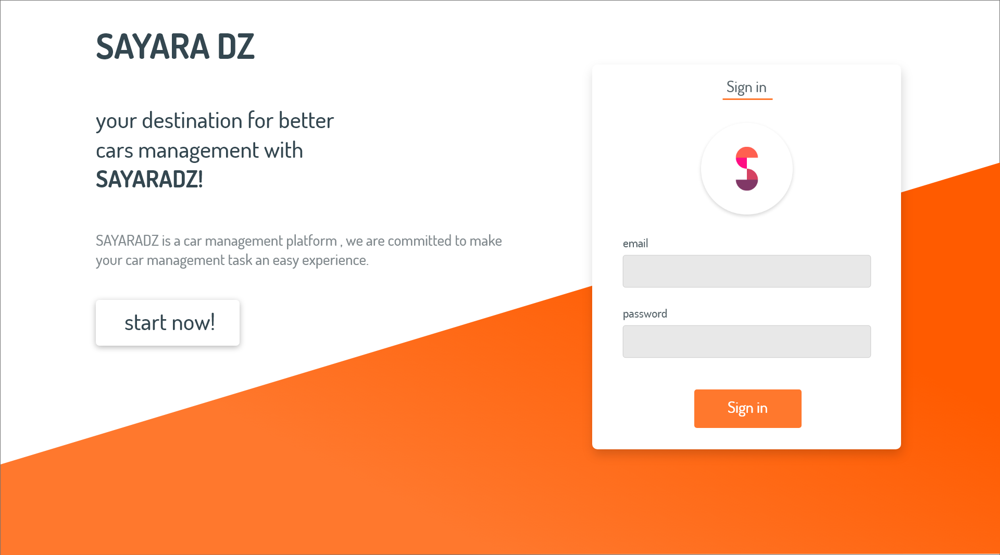
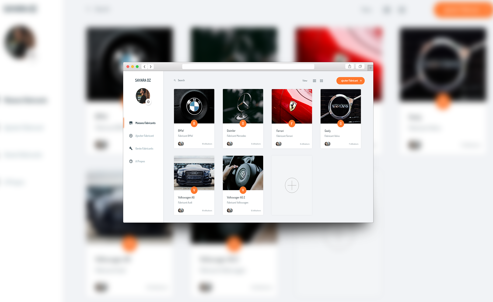
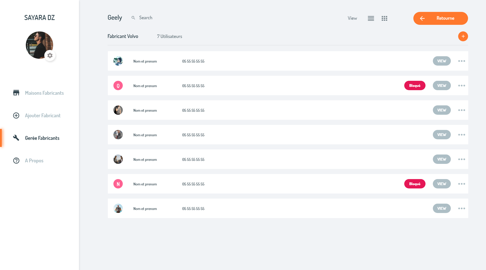
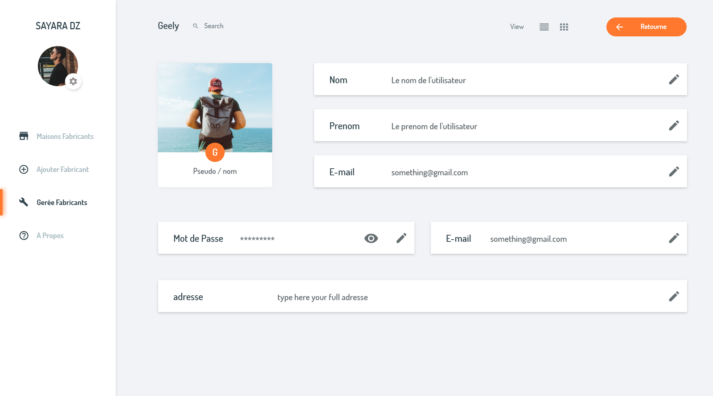
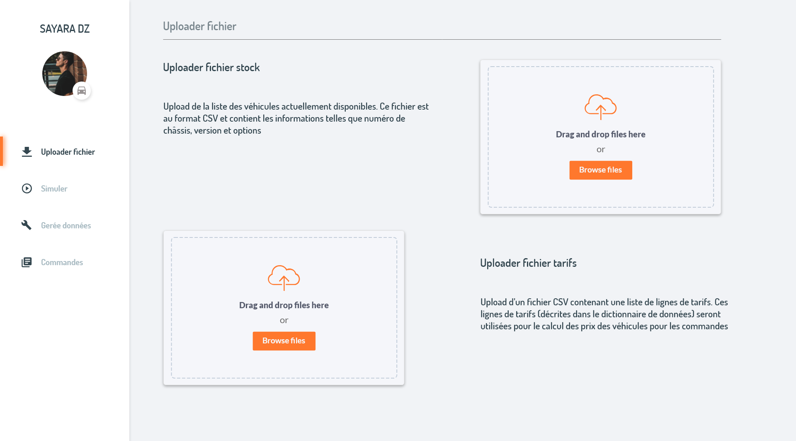
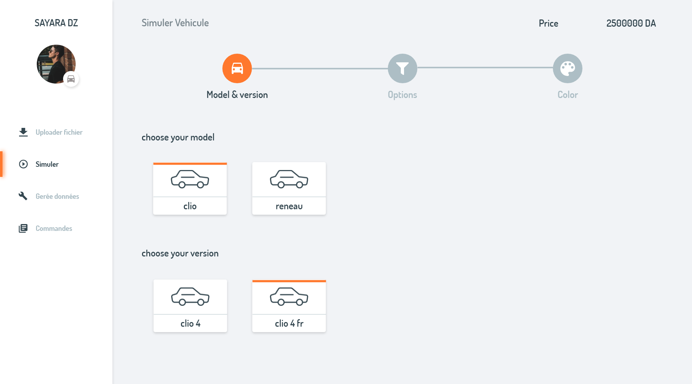
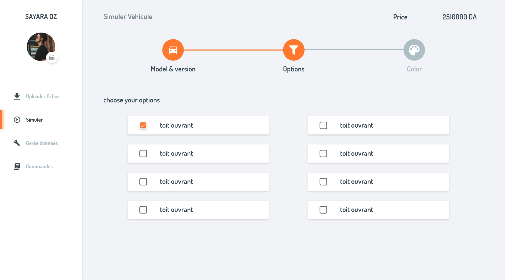
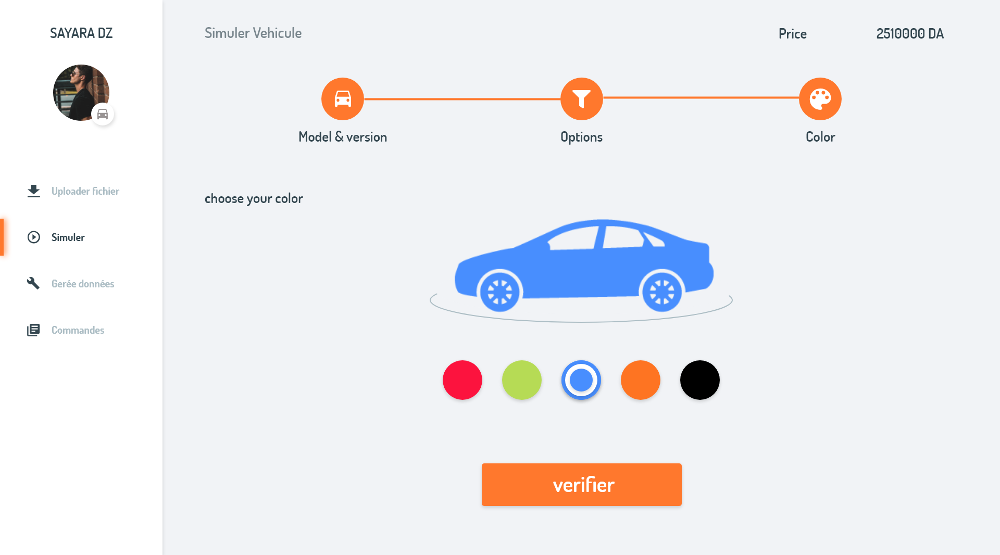

## SayaraDZ

this project was made with react and material design, and it was bootstrapped with [Create React App](https://github.com/facebook/create-react-app).

the project consist of a web platform for selling, buying and managing cars (old and new cars).

it is devised into two sides, the admin side and the client side.

the admin can manage cars, options, marks, and all kind of parameters for cars, and he can also define some sub admins per categories or by affiliation.

for the client side, he can search cars while using some filters and he can live simulate options and cars customization.

## How does the project looks like ?

- **Auth :** 

- **Home :**

- **Managing manufacturers :** 

- **Profile :** 

- **Upload :** 

- **Simulation :** 

and many other screens ... 

